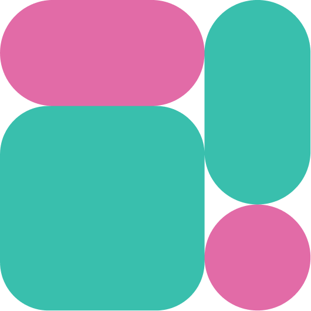

<div align="center">
  <picture>
    
  </picture>
  <h1>Malga Node.js SDK</h1>
</div>


Simple way to integrate with Malga

## Getting Started

Learn how to quickly integrate Malga into your project. For more details on integration, simply [click here](https://docs.malga.io/docs/api-sdks/intro).

1. First of all, you'll need to install our SDK into your project:

```bash
yarn add malga
# or
npm install malga
# or
pnpm add malga
```

2. Make your first charge in a simplified way

```ts
import { Malga } from 'malga'

const malga = new Malga({
  apiKey: 'YOUR_API_KEY',
  clientId: 'YOUR_CLIENT_ID',
  options: { sandbox: true },
})

(async function () {
  try {
    const data = await malga.charges.create({
      merchantId: 'YOUR_MERCHANT_ID',
      amount: 100,
      paymentMethod: {
        type: 'credit',
        installments: 1,
        card: {
          holderName: 'João da Silva',
          number: '5453881028277600',
          cvv: '170',
          expirationDate: '10/2030',
        },
      },
    })

    console.log(data)
  } catch (error) {
    console.error(error)
  }
})()
```

## Examples

If you have any doubts about the integration, you can [click here](https://github.com/plughacker/malga-node/tree/main/examples) to see some examples

## Contributing

Feel free to contribute to this project by submitting pull requests, creating documentation, or bringing ideas to make the project even better!
